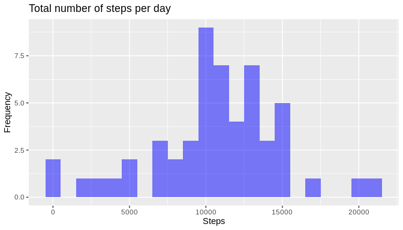
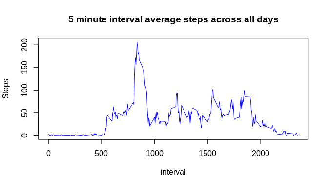
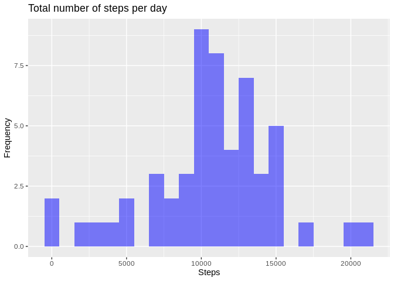
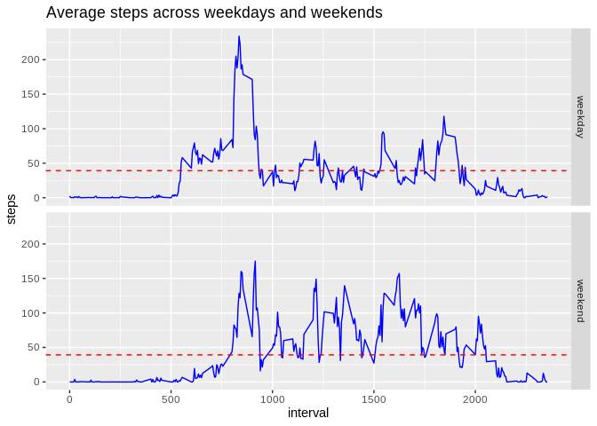

### Load the necessary packages

```r
library (lubridate)
```

```
## Warning: package 'lubridate' was built under R version 3.6.3
```

```
## 
## Attaching package: 'lubridate'
```

```
## The following objects are masked from 'package:base':
## 
##     date, intersect, setdiff, union
```

```r
library(dplyr)
```

```
## Warning: package 'dplyr' was built under R version 3.6.3
```

```
## 
## Attaching package: 'dplyr'
```

```
## The following objects are masked from 'package:lubridate':
## 
##     intersect, setdiff, union
```

```
## The following objects are masked from 'package:stats':
## 
##     filter, lag
```

```
## The following objects are masked from 'package:base':
## 
##     intersect, setdiff, setequal, union
```

## Preprocessing the data
- Load the data (i.e. read.csv()\color{red}{\verb|read.csv()|}read.csv())
- Process/transform the data (if necessary) into a format suitable for your analysis


```r
#Start with setting where the files are located
if(!file.exists("./data")){dir.create("./data")}

#Set the URLs
dataZip <- "./data/repdata_data_activity.zip"
dataURL <- "https://d396qusza40orc.cloudfront.net/repdata%2Fdata%2Factivity.zip"

#download and unzip the downloaded files
if (!file.exists(dataZip)){
  download.file(dataURL, dataZip, method="curl")
  unzip(dataZip, exdir="./data")
}  

activityData <- read.csv("./data/activity.csv", header=TRUE, sep= ",", na.strings ="NA")

activityData$dateformat <- as.Date.factor(activityData$date, format = "%Y-%m-%d")
```


## Question 1. -  What is mean total number of steps taken per day?
For this part of the assignment, you can ignore the missing values in the dataset.

+ Calculate the total number of steps taken per day

+ If you do not understand the difference between a histogram and a barplot, research the difference between them. Make a histogram of the total number of steps taken each day

+ Calculate and report the mean and median of the total number of steps taken per day


```r
library(ggplot2)
```

```
## Warning: package 'ggplot2' was built under R version 3.6.3
```

```r
#Calculate the steps per day
daysteps <- activityData %>% filter(!is.na(steps)) %>% group_by(dateformat)%>%summarize(daysteps = sum(steps))

#Make histogram
ggplot(daysteps, aes(x=daysteps)) + geom_histogram(fill="blue", alpha=0.5, binwidth = 1000, position="identity")+labs(title = "Total number of steps per day", x="Steps", y = "Frequency") 
```

<!-- -->

```r
#Calculate and report the mean an median
stepMean <- round(mean(daysteps$daysteps, na.rm=TRUE), digits = 2)
stepMedian <- round(median(daysteps$daysteps, na.rm = TRUE), digits = 2)

print(stepMean)
```

[1] 10766.19

```r
print(stepMedian)
```

[1] 10765

<span style="color: blue;"> Observations: The mean for the total number of steps is 1.076619\times 10^{4} and  the median is 1.0765\times 10^{4}. Since the mean and median are close, we can expect a symmetrical distribution</span>.


## Question 2. What is the average daily activity pattern?

+ Make a time series plot (i.e. type = "l"\color{red}{\verb|type = "l"|}type = "l") of the 5-minute interval (x-axis) and the average number of steps taken, averaged across all days (y-axis)


```r
intervals <- activityData %>% filter(!is.na(steps)) %>% group_by(interval) %>% summarize(steps = mean(steps))

plot(x=intervals,y=activityData$steps, type="l", col="blue")+title(main="5 minute interval average steps across all days", ylab="Steps")
```

<!-- -->integer(0)
+ Which 5-minute interval, on average across all the days in the dataset, contains the maximum number of steps?

```r
maxInterval <-intervals[ which.max(intervals$steps),]
print(maxInterval)
```

```
## # A tibble: 1 x 2
##   interval steps
##      <int> <dbl>
## 1      835  206.
```
<span style="color: blue;"> Observations: The maximum number of steps is 206.1698113 and  can be found in interval with identifier 835</span>.

## Question 3. Imputing missing values

Note that there are a number of days/intervals where there are missing values (coded as NA\color{red}{\verb|NA|}). 

The presence of missing days may introduce bias into some calculations or summaries of the data.

+ Calculate and report the total number of missing values in the dataset (i.e. the total number of rows with NAs\color{red}{\verb|NA|})

```r
#Find the missing values
sum(is.na(activityData$steps))
```

```
## [1] 2304
```

```r
sum(is.na(activityData$date))
```

```
## [1] 0
```

```r
sum(is.na(activityData$interval))
```

```
## [1] 0
```

```r
percentage <- round(sum(is.na(activityData$steps))/nrow(activityData)*100, digits = 2)
```
<span style="color: blue;"> Observations: Only steps has missing values that account for 13.11%. This might definately introduce a bias and a strategy should be  considered for these values.
</span>.

+ Devise a strategy for filling in all of the missing values in the dataset. The strategy does not need to be sophisticated. For example, you could use the mean/median for that day, or the mean for that 5-minute interval, etc.

+ Create a new dataset that is equal to the original dataset but with the missing data filled in.


```r
# Substitute missing values with the mean for the day

data <- activityData
nas <- is.na(data$steps)
avg_day <- mean(data$steps, na.rm = TRUE)
data$steps[nas] <- avg_day[data$date[nas]]
```

+ Make a histogram of the total number of steps taken each day and Calculate and report the mean and median total number of steps taken per day. Do these values differ from the estimates from the first part of the assignment? What is the impact of imputing missing data on the estimates of the total daily number of steps?


```r
#Calculate the steps per day
daysteps2 <- data %>% filter(!is.na(steps)) %>% group_by(dateformat)%>%summarize(steps = sum(steps))

#Make histogram
ggplot(daysteps2, aes(x=steps)) + geom_histogram(fill="blue", alpha=0.5, binwidth = 1000, position="identity") + labs(title = "Total number of steps per day", x="Steps", y = "Frequency") 
```

<!-- -->

```r
#Calculate and report the mean an median
stepMean2 <- round(mean(daysteps2$steps, na.rm=TRUE), digits = 2)
stepMedian2 <- round(median(daysteps2$steps, na.rm = TRUE), digits = 2)

print(stepMean2)
```

```
## [1] 10766.19
```

```r
print(stepMedian2)
```

```
## [1] 10765.59
```


```
## Warning in daysteps2$steps - daysteps$daysteps: longitud de objeto mayor no es
## múltiplo de la longitud de uno menor
```

<span style="color: blue;"> Observations: The mean for the total number of steps is 1.076619\times 10^{4} and  the median is 1.076559\times 10^{4}. The mean remains the same while the median slightly increased since the average steps is in the substituted values is always greater than zero. The sum of the steps that are included in the strategy represent only 1.8647107 of the total steps taken without considering the NAs.
The affected dates are: 2012-10-01, 2012-10-08, 2012-11-01, 2012-11-04, 2012-11-09, 2012-11-10, 2012-11-14, 2012-11-30 
</span>.

## Question 4.  Are there differences in activity patterns between weekdays and weekends?

For this part the weekdays()\color{red}{\verb|weekdays()|} function may be of some help here. Use the dataset with the filled-in missing values for this part.

```r
library(lubridate)
is_weekday <- function(datex) {
   x<-wday(datex, label=TRUE, abbr = TRUE)
   if(grepl("^(s|d)", x, ignore.case = TRUE)){
     result <-"weekend"
   }
   else{
     result <- "weekday"
   }
   result
}
```

+ Create a new factor variable in the dataset with two levels – “weekday” and “weekend” indicating whether a given date is a weekday or weekend day.


```r
require(lubridate)
for( i in 1:nrow(activityData)){
  activityData$weekday[i] <- wday(activityData$dateformat[i], label= TRUE) 
  activityData$dayType[i] <- is_weekday(activityData$dateformat[i])
}
```


+ Make a panel plot containing a time series plot (i.e. type = "l"\color{red}{\verb|type = "l"|}) of the 5-minute interval (x-axis) and the average number of steps taken, averaged across all weekday days or weekend days (y-axis). See the README file in the GitHub repository to see an example of what this plot should look like using simulated data.


```r
data2plot <- aggregate(steps ~ interval + dayType, data= activityData, FUN=mean, na.action = na.omit)

mean2plot<- mean(data2plot$steps)
ggplot(data2plot, aes(interval, steps))+ geom_line(col="blue")+facet_grid(dayType ~.)+geom_hline(yintercept=mean2plot, linetype="dashed", color = "red")+ggtitle("Average steps across weekdays and weekends")
```

<!-- -->


<span style="color: blue;"> Observations: The average number of steps seem to increase during the weekends as the graphs show.
</span>.

